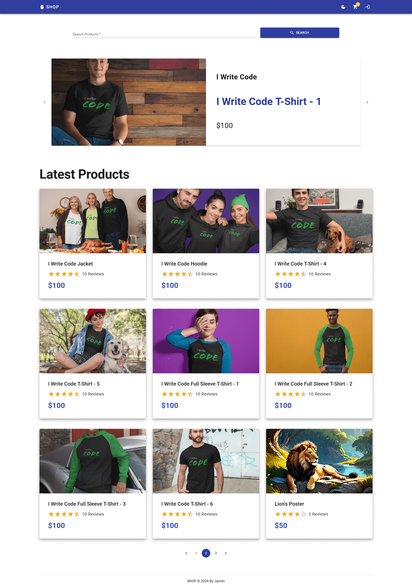
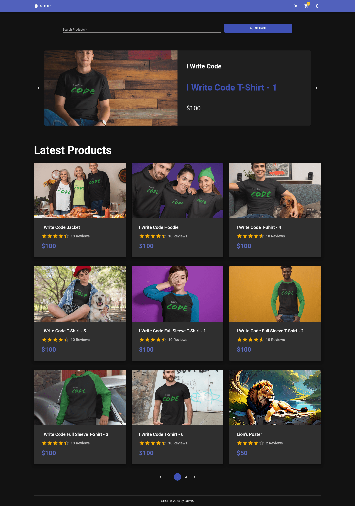
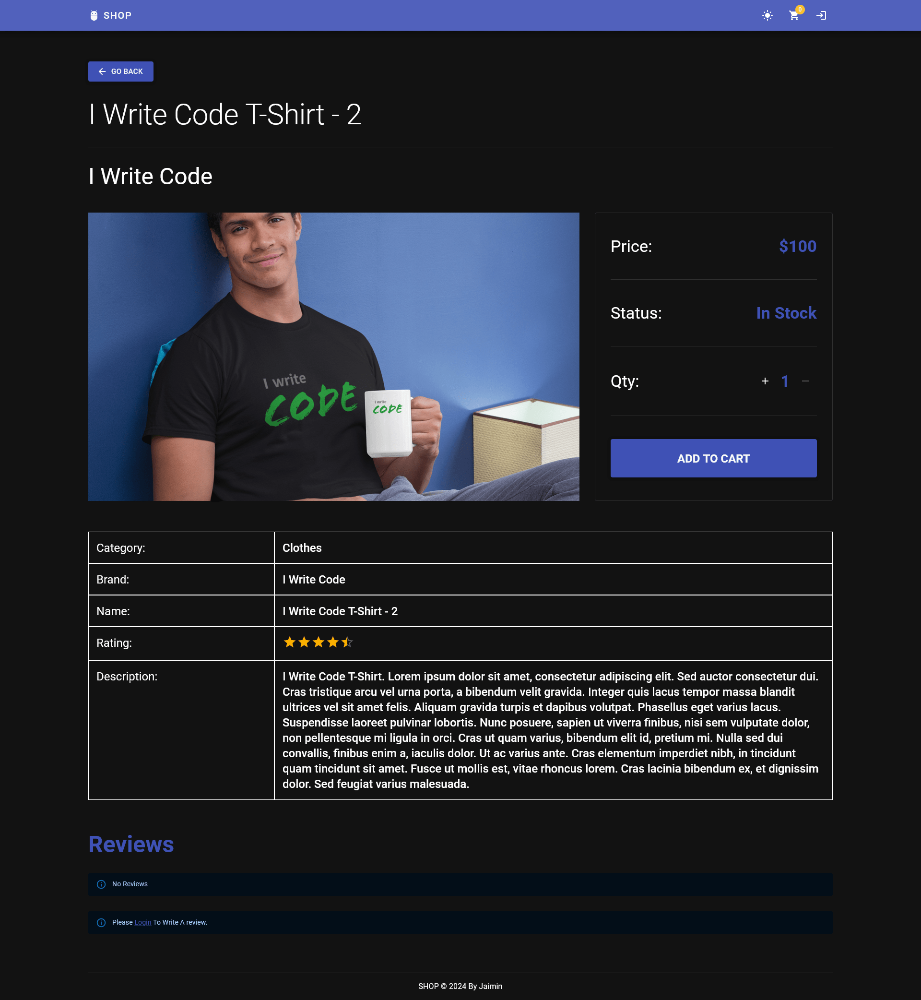
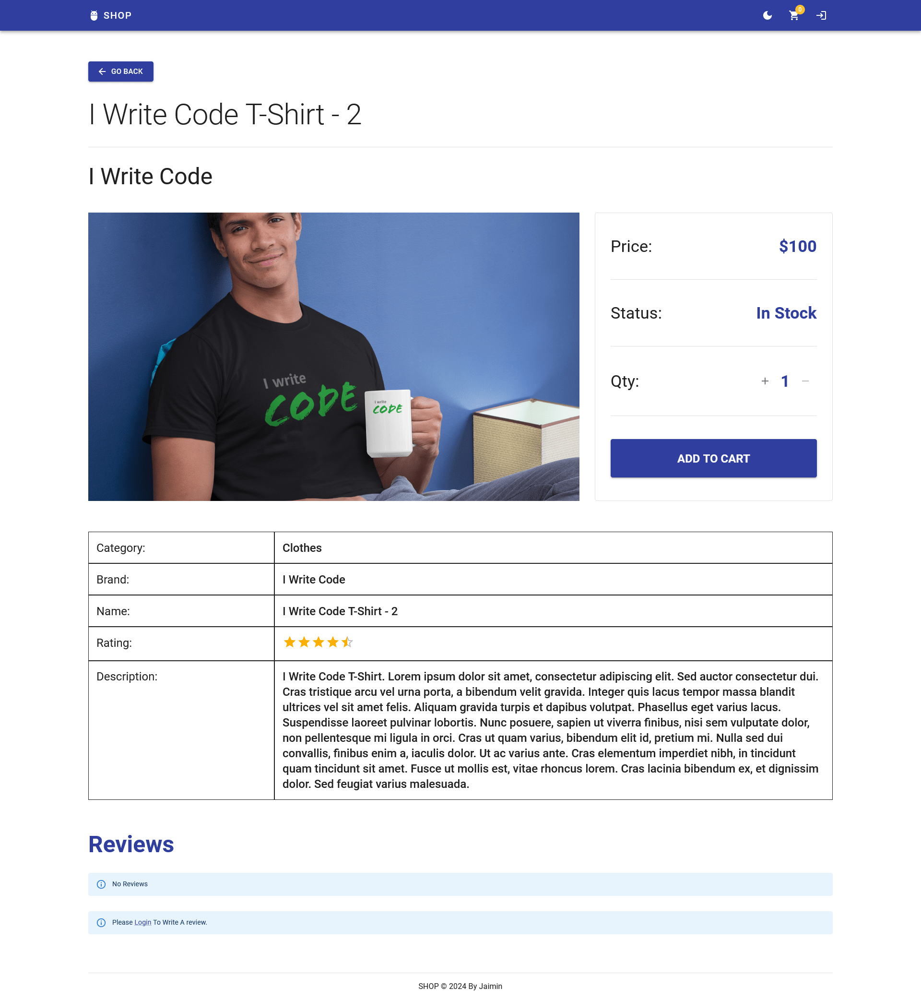
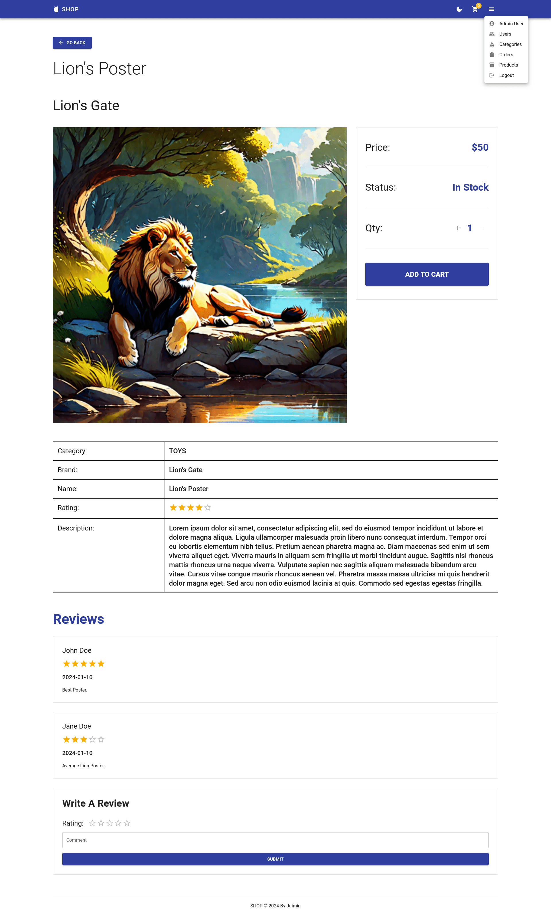
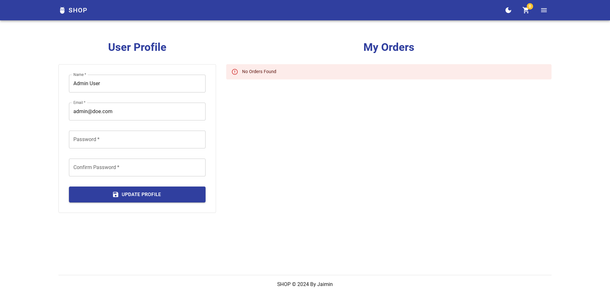
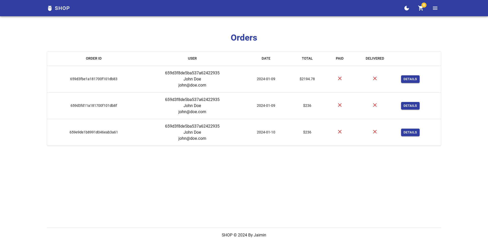
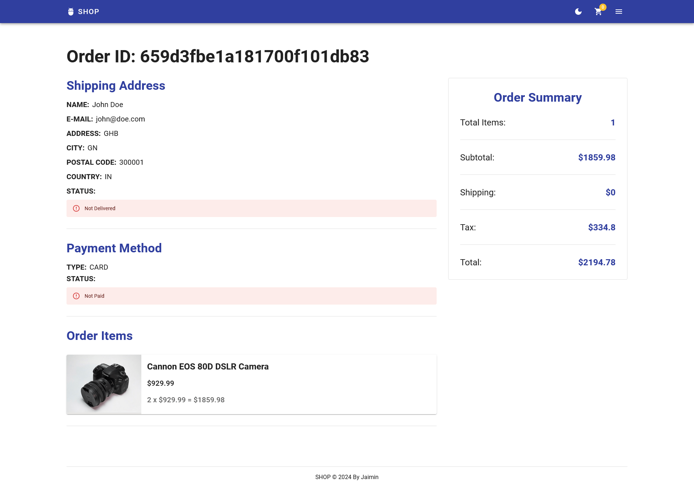
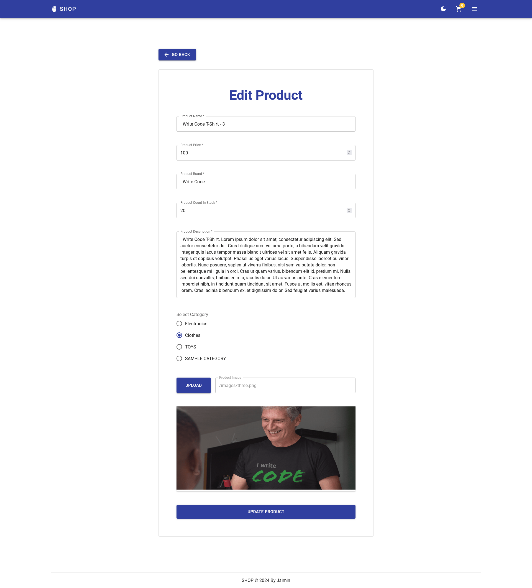
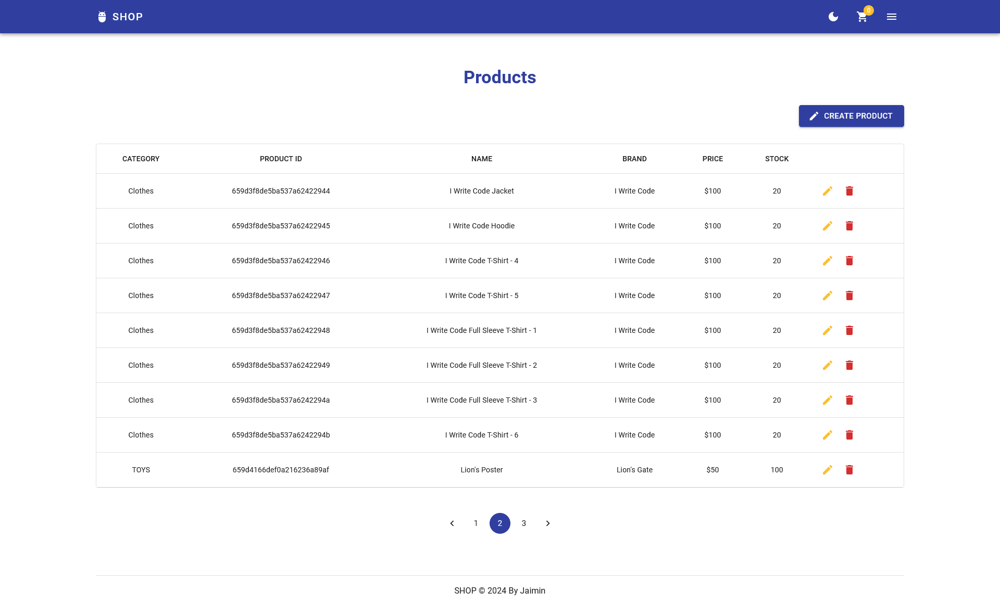

# MERN E-Commerce

E-Commerce Application Built Using MERN Stack Technologies for iNeuron Full Stack Developer Internship.


## Features

- Light/Dark Mode Toggle
- Global Product Search
- PayPal Payment Gateway Integration
- Products CRUD
- Orders CRUD
- Categories CRUD
- Users CRUD with JWT Authentication and Roles Based Authorization
- Products Management Dashboard
- Orders Management Dashboard
- Users Management Dashboard
- Categories Management Dashboard
- Product Image Upload To Server
- Caching API Resonponses With RTK Query


## Environment Variables

- To run frontend of this project, you will need to add the following environment variables to your .env file

    `VITE_SERVER_URL='Your SERVER URL'`

- To run backend of this project, you will need to add the following environment variables to your .env file

    `NODE_ENV=dev or production`

    `PORT=Port For Server`

    `MONGODB_URL=MongoDB URL`

    `JWT_SECRET=JWT Secret`

    `JWT_EXPIRY=JWT Token Exipry e.g. 1d`

    `PAYPAL_CLIENT_ID=Paypal Client ID`

    `PAYPAL_APP_SECRET=Paypal App Secret`

    `PAYPAL_API_URL=Paypal API URL`

    `PAGINATION_LIMIT=How Many Items Per Page To Show`


## Installation

#### Requirements:

- Node.js (>= v20.0.0)
- PNPM Package Manager (>= v8.14.0)
- MongoDB Community Server (>= v7.0.0)
- Windows, Mac OS or Any Linux Distro


## Run Locally

Clone the project

```bash
  git clone https://github.com/enthr/MERN_ECommerce.git
```

Go to the project directory

```bash
  cd MERN_ECommerce
```

Install dependencies

```bash
  cd frontend
  pnpm install
```

```bash
  cd backend
  pnpm install
```

Start The Server. Make Sure To Define Environment Variables As Mentioned in Previous Sections.

```bash
  cd frontend
  pnpm dev
```

```bash
  cd backend
  pnpm dev
```


## Tech Stack

#### Frontend:
- **Language:** JavaScript
- **UI Libraries:** React, React Router, React Toastify, React Paypal JS
- **Styling Library**: Materia UI With Emotion Styling Engine
- **Icons Library:** Material Icons
- **State Management:** Redux Toolkit and Redux Toolkit Query
- **Meta Data:** React Helmet Async
- **Build System:** Vite, SWC, ESlint

#### Backend:
- **Language:** JavaScript/Node.js
- **Framework:** Express
- **Database:** MongoDB
- **ORM/ODM:** Mongoose
- **Libraries:** bcrypt, cors, cookie-parser, jsonwebtoken, multer, dotenv


## Author

- [@enthr](https://www.github.com/enthr)


## Screenshots



















